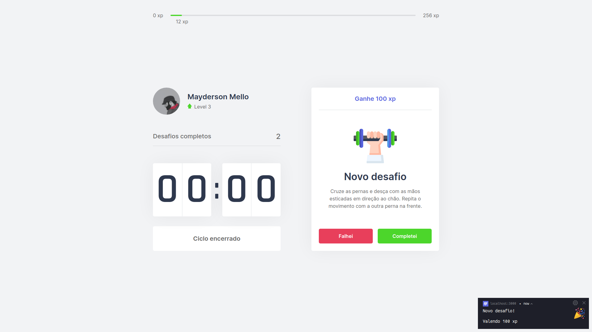

<h1 align="center">
  
</h1>

<br />

<p align="center">
  

  
</p>

---

<p align="center">
  <a href="#-technologies">Technologies</a>&nbsp;&nbsp;&nbsp;|&nbsp;&nbsp;&nbsp;
  <a href="#-project">Project</a>&nbsp;&nbsp;&nbsp;|&nbsp;&nbsp;&nbsp;
  <a href="#-layout">Layout</a>&nbsp;&nbsp;&nbsp;|&nbsp;&nbsp;&nbsp;
  <a href="#memo-license">License</a>
</p>

<br>

<p align="center">
  
</p>

## 🚀 Technologies

This project was developed with the following technologies:

- [ReactJS](https://reactjs.org)
- [Next.js](https://nextjs.org)
- [TypeScript](https://www.typescriptlang.org)

## 💻 Project

Move.it é um aplicativo que consiste em aplicar a técnica Pomodoro. É um método de gerenciamento de tempo, consiste na utilização de um cronômetro para dividir o trabalho em períodos de 25 minutos, separados por breves intervalos.

## 🔖 Layout

In the links below you will find the layout of the web project.

- [Layout Web](https://www.figma.com/file/mFQRz9dQo7QsNOgGBhkUxc/Move.it)

## Getting Started

First, run the development server:

```bash
npm run dev
# or
yarn dev
```

Open [http://localhost:3000](http://localhost:3000) with your browser to see the result.

## :globe_with_meridians: Deploy on Vercel

- [Move.it](https://moveit-sup3r-us3r.vercel.app)

## :memo: License

This project is under the MIT license. See the file [LICENSE](LICENSE) for more details.
